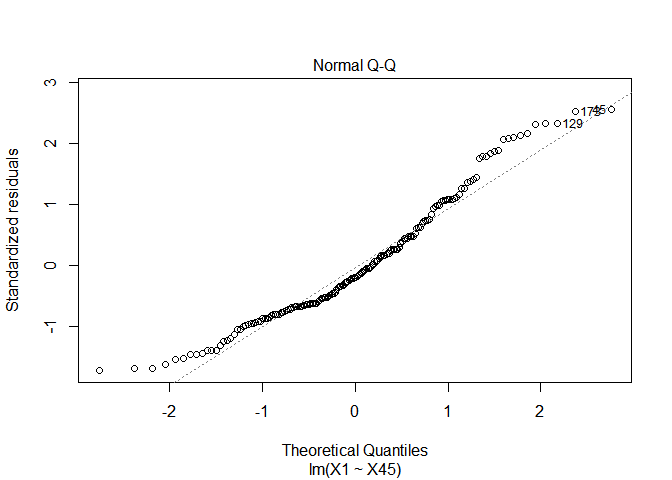
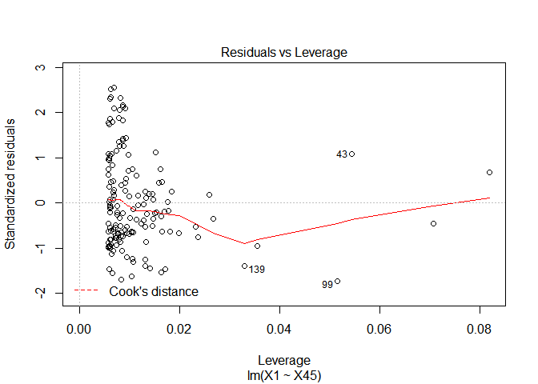

Spectroscopy
================
Nina Kumagai
6 October 2018

``` r
library(caret)
```

    ## Loading required package: lattice

    ## Loading required package: ggplot2

``` r
#Caret is package that brings the tecator in.
```

``` r
data(tecator)
```

``` r
summary(absorp)
```

    ##        V1              V2              V3              V4       
    ##  Min.   :2.066   Min.   :2.066   Min.   :2.065   Min.   :2.065  
    ##  1st Qu.:2.512   1st Qu.:2.513   1st Qu.:2.514   1st Qu.:2.515  
    ##  Median :2.754   Median :2.755   Median :2.757   Median :2.758  
    ##  Mean   :2.809   Mean   :2.811   Mean   :2.814   Mean   :2.816  
    ##  3rd Qu.:3.006   3rd Qu.:3.010   3rd Qu.:3.015   3rd Qu.:3.019  
    ##  Max.   :4.237   Max.   :4.247   Max.   :4.257   Max.   :4.268  
    ##        V5              V6              V7              V8       
    ##  Min.   :2.064   Min.   :2.064   Min.   :2.063   Min.   :2.063  
    ##  1st Qu.:2.517   1st Qu.:2.518   1st Qu.:2.518   1st Qu.:2.519  
    ##  Median :2.760   Median :2.762   Median :2.764   Median :2.766  
    ##  Mean   :2.819   Mean   :2.822   Mean   :2.825   Mean   :2.828  
    ##  3rd Qu.:3.026   3rd Qu.:3.033   3rd Qu.:3.040   3rd Qu.:3.047  
    ##  Max.   :4.278   Max.   :4.290   Max.   :4.301   Max.   :4.313  
    ##        V9             V10             V11             V12       
    ##  Min.   :2.063   Min.   :2.063   Min.   :2.063   Min.   :2.064  
    ##  1st Qu.:2.519   1st Qu.:2.521   1st Qu.:2.524   1st Qu.:2.527  
    ##  Median :2.769   Median :2.771   Median :2.774   Median :2.777  
    ##  Mean   :2.832   Mean   :2.836   Mean   :2.840   Mean   :2.844  
    ##  3rd Qu.:3.054   3rd Qu.:3.062   3rd Qu.:3.069   3rd Qu.:3.077  
    ##  Max.   :4.326   Max.   :4.339   Max.   :4.353   Max.   :4.368  
    ##       V13             V14             V15             V16       
    ##  Min.   :2.064   Min.   :2.065   Min.   :2.066   Min.   :2.067  
    ##  1st Qu.:2.529   1st Qu.:2.532   1st Qu.:2.536   1st Qu.:2.539  
    ##  Median :2.780   Median :2.788   Median :2.794   Median :2.796  
    ##  Mean   :2.849   Mean   :2.854   Mean   :2.860   Mean   :2.866  
    ##  3rd Qu.:3.085   3rd Qu.:3.093   3rd Qu.:3.101   3rd Qu.:3.110  
    ##  Max.   :4.384   Max.   :4.401   Max.   :4.419   Max.   :4.438  
    ##       V17             V18             V19             V20       
    ##  Min.   :2.068   Min.   :2.069   Min.   :2.071   Min.   :2.073  
    ##  1st Qu.:2.543   1st Qu.:2.547   1st Qu.:2.551   1st Qu.:2.556  
    ##  Median :2.798   Median :2.803   Median :2.812   Median :2.822  
    ##  Mean   :2.872   Mean   :2.879   Mean   :2.887   Mean   :2.895  
    ##  3rd Qu.:3.119   3rd Qu.:3.129   3rd Qu.:3.140   3rd Qu.:3.153  
    ##  Max.   :4.458   Max.   :4.480   Max.   :4.503   Max.   :4.528  
    ##       V21             V22             V23             V24       
    ##  Min.   :2.075   Min.   :2.077   Min.   :2.080   Min.   :2.082  
    ##  1st Qu.:2.563   1st Qu.:2.570   1st Qu.:2.576   1st Qu.:2.581  
    ##  Median :2.832   Median :2.842   Median :2.850   Median :2.855  
    ##  Mean   :2.903   Mean   :2.911   Mean   :2.920   Mean   :2.927  
    ##  3rd Qu.:3.166   3rd Qu.:3.176   3rd Qu.:3.186   3rd Qu.:3.195  
    ##  Max.   :4.554   Max.   :4.580   Max.   :4.606   Max.   :4.630  
    ##       V25             V26             V27             V28       
    ##  Min.   :2.084   Min.   :2.086   Min.   :2.089   Min.   :2.091  
    ##  1st Qu.:2.586   1st Qu.:2.590   1st Qu.:2.596   1st Qu.:2.603  
    ##  Median :2.860   Median :2.865   Median :2.870   Median :2.877  
    ##  Mean   :2.935   Mean   :2.943   Mean   :2.950   Mean   :2.959  
    ##  3rd Qu.:3.205   3rd Qu.:3.214   3rd Qu.:3.224   3rd Qu.:3.231  
    ##  Max.   :4.653   Max.   :4.675   Max.   :4.699   Max.   :4.725  
    ##       V29             V30             V31             V32       
    ##  Min.   :2.093   Min.   :2.095   Min.   :2.097   Min.   :2.098  
    ##  1st Qu.:2.610   1st Qu.:2.614   1st Qu.:2.619   1st Qu.:2.625  
    ##  Median :2.891   Median :2.897   Median :2.902   Median :2.915  
    ##  Mean   :2.968   Mean   :2.978   Mean   :2.989   Mean   :3.000  
    ##  3rd Qu.:3.242   3rd Qu.:3.255   3rd Qu.:3.271   3rd Qu.:3.292  
    ##  Max.   :4.755   Max.   :4.789   Max.   :4.826   Max.   :4.865  
    ##       V33             V34             V35             V36       
    ##  Min.   :2.101   Min.   :2.103   Min.   :2.107   Min.   :2.112  
    ##  1st Qu.:2.635   1st Qu.:2.648   1st Qu.:2.661   1st Qu.:2.672  
    ##  Median :2.922   Median :2.929   Median :2.940   Median :2.958  
    ##  Mean   :3.011   Mean   :3.023   Mean   :3.035   Mean   :3.048  
    ##  3rd Qu.:3.314   3rd Qu.:3.336   3rd Qu.:3.365   3rd Qu.:3.391  
    ##  Max.   :4.903   Max.   :4.940   Max.   :4.975   Max.   :5.012  
    ##       V37             V38             V39             V40       
    ##  Min.   :2.119   Min.   :2.128   Min.   :2.139   Min.   :2.151  
    ##  1st Qu.:2.685   1st Qu.:2.699   1st Qu.:2.713   1st Qu.:2.727  
    ##  Median :2.972   Median :2.984   Median :2.997   Median :3.017  
    ##  Mean   :3.063   Mean   :3.079   Mean   :3.096   Mean   :3.114  
    ##  3rd Qu.:3.423   3rd Qu.:3.454   3rd Qu.:3.467   3rd Qu.:3.483  
    ##  Max.   :5.049   Max.   :5.086   Max.   :5.121   Max.   :5.153  
    ##       V41             V42             V43             V44       
    ##  Min.   :2.166   Min.   :2.183   Min.   :2.201   Min.   :2.221  
    ##  1st Qu.:2.743   1st Qu.:2.759   1st Qu.:2.775   1st Qu.:2.789  
    ##  Median :3.035   Median :3.051   Median :3.063   Median :3.072  
    ##  Mean   :3.131   Mean   :3.146   Mean   :3.160   Mean   :3.172  
    ##  3rd Qu.:3.499   3rd Qu.:3.516   3rd Qu.:3.529   3rd Qu.:3.529  
    ##  Max.   :5.176   Max.   :5.187   Max.   :5.185   Max.   :5.173  
    ##       V45             V46             V47             V48       
    ##  Min.   :2.243   Min.   :2.267   Min.   :2.292   Min.   :2.321  
    ##  1st Qu.:2.800   1st Qu.:2.812   1st Qu.:2.833   1st Qu.:2.859  
    ##  Median :3.080   Median :3.097   Median :3.113   Median :3.135  
    ##  Mean   :3.183   Mean   :3.195   Mean   :3.210   Mean   :3.229  
    ##  3rd Qu.:3.509   3rd Qu.:3.503   3rd Qu.:3.503   3rd Qu.:3.514  
    ##  Max.   :5.153   Max.   :5.132   Max.   :5.117   Max.   :5.111  
    ##       V49             V50             V51             V52       
    ##  Min.   :2.354   Min.   :2.391   Min.   :2.433   Min.   :2.478  
    ##  1st Qu.:2.887   1st Qu.:2.916   1st Qu.:2.953   1st Qu.:2.995  
    ##  Median :3.160   Median :3.191   Median :3.230   Median :3.279  
    ##  Mean   :3.254   Mean   :3.286   Mean   :3.324   Mean   :3.368  
    ##  3rd Qu.:3.530   3rd Qu.:3.550   3rd Qu.:3.594   3rd Qu.:3.627  
    ##  Max.   :5.117   Max.   :5.135   Max.   :5.165   Max.   :5.206  
    ##       V53             V54             V55             V56       
    ##  Min.   :2.525   Min.   :2.572   Min.   :2.613   Min.   :2.648  
    ##  1st Qu.:3.040   1st Qu.:3.083   1st Qu.:3.122   1st Qu.:3.158  
    ##  Median :3.328   Median :3.382   Median :3.421   Median :3.466  
    ##  Mean   :3.415   Mean   :3.462   Mean   :3.506   Mean   :3.543  
    ##  3rd Qu.:3.668   3rd Qu.:3.714   3rd Qu.:3.761   3rd Qu.:3.803  
    ##  Max.   :5.252   Max.   :5.299   Max.   :5.344   Max.   :5.382  
    ##       V57             V58             V59             V60       
    ##  Min.   :2.674   Min.   :2.693   Min.   :2.707   Min.   :2.716  
    ##  1st Qu.:3.184   1st Qu.:3.201   1st Qu.:3.213   1st Qu.:3.221  
    ##  Median :3.503   Median :3.527   Median :3.537   Median :3.544  
    ##  Mean   :3.571   Mean   :3.590   Mean   :3.603   Mean   :3.612  
    ##  3rd Qu.:3.832   3rd Qu.:3.852   3rd Qu.:3.864   3rd Qu.:3.871  
    ##  Max.   :5.412   Max.   :5.433   Max.   :5.447   Max.   :5.455  
    ##       V61             V62             V63             V64       
    ##  Min.   :2.724   Min.   :2.729   Min.   :2.733   Min.   :2.735  
    ##  1st Qu.:3.227   1st Qu.:3.231   1st Qu.:3.233   1st Qu.:3.233  
    ##  Median :3.551   Median :3.556   Median :3.557   Median :3.557  
    ##  Mean   :3.618   Mean   :3.622   Mean   :3.624   Mean   :3.624  
    ##  3rd Qu.:3.876   3rd Qu.:3.878   3rd Qu.:3.878   3rd Qu.:3.876  
    ##  Max.   :5.462   Max.   :5.467   Max.   :5.471   Max.   :5.473  
    ##       V65             V66             V67             V68       
    ##  Min.   :2.735   Min.   :2.733   Min.   :2.730   Min.   :2.725  
    ##  1st Qu.:3.229   1st Qu.:3.223   1st Qu.:3.215   1st Qu.:3.206  
    ##  Median :3.553   Median :3.548   Median :3.540   Median :3.530  
    ##  Mean   :3.622   Mean   :3.618   Mean   :3.613   Mean   :3.605  
    ##  3rd Qu.:3.873   3rd Qu.:3.869   3rd Qu.:3.864   3rd Qu.:3.857  
    ##  Max.   :5.474   Max.   :5.471   Max.   :5.465   Max.   :5.458  
    ##       V69             V70             V71             V72       
    ##  Min.   :2.718   Min.   :2.710   Min.   :2.700   Min.   :2.689  
    ##  1st Qu.:3.198   1st Qu.:3.186   1st Qu.:3.174   1st Qu.:3.162  
    ##  Median :3.517   Median :3.505   Median :3.496   Median :3.486  
    ##  Mean   :3.596   Mean   :3.585   Mean   :3.573   Mean   :3.560  
    ##  3rd Qu.:3.849   3rd Qu.:3.840   3rd Qu.:3.830   3rd Qu.:3.818  
    ##  Max.   :5.451   Max.   :5.441   Max.   :5.429   Max.   :5.417  
    ##       V73             V74             V75             V76       
    ##  Min.   :2.677   Min.   :2.663   Min.   :2.649   Min.   :2.634  
    ##  1st Qu.:3.149   1st Qu.:3.135   1st Qu.:3.119   1st Qu.:3.102  
    ##  Median :3.475   Median :3.463   Median :3.447   Median :3.426  
    ##  Mean   :3.546   Mean   :3.530   Mean   :3.514   Mean   :3.497  
    ##  3rd Qu.:3.806   3rd Qu.:3.795   3rd Qu.:3.784   3rd Qu.:3.772  
    ##  Max.   :5.406   Max.   :5.396   Max.   :5.384   Max.   :5.370  
    ##       V77             V78             V79             V80       
    ##  Min.   :2.619   Min.   :2.602   Min.   :2.586   Min.   :2.569  
    ##  1st Qu.:3.084   1st Qu.:3.066   1st Qu.:3.047   1st Qu.:3.027  
    ##  Median :3.405   Median :3.384   Median :3.368   Median :3.350  
    ##  Mean   :3.479   Mean   :3.461   Mean   :3.443   Mean   :3.425  
    ##  3rd Qu.:3.760   3rd Qu.:3.744   3rd Qu.:3.729   3rd Qu.:3.707  
    ##  Max.   :5.356   Max.   :5.343   Max.   :5.330   Max.   :5.318  
    ##       V81             V82             V83             V84       
    ##  Min.   :2.551   Min.   :2.533   Min.   :2.515   Min.   :2.496  
    ##  1st Qu.:3.007   1st Qu.:2.988   1st Qu.:2.967   1st Qu.:2.946  
    ##  Median :3.329   Median :3.305   Median :3.281   Median :3.256  
    ##  Mean   :3.406   Mean   :3.388   Mean   :3.368   Mean   :3.349  
    ##  3rd Qu.:3.691   3rd Qu.:3.675   3rd Qu.:3.656   3rd Qu.:3.639  
    ##  Max.   :5.307   Max.   :5.295   Max.   :5.284   Max.   :5.272  
    ##       V85             V86             V87             V88       
    ##  Min.   :2.477   Min.   :2.457   Min.   :2.437   Min.   :2.418  
    ##  1st Qu.:2.923   1st Qu.:2.901   1st Qu.:2.879   1st Qu.:2.857  
    ##  Median :3.231   Median :3.205   Median :3.180   Median :3.157  
    ##  Mean   :3.328   Mean   :3.307   Mean   :3.285   Mean   :3.263  
    ##  3rd Qu.:3.621   3rd Qu.:3.602   3rd Qu.:3.581   3rd Qu.:3.559  
    ##  Max.   :5.257   Max.   :5.240   Max.   :5.220   Max.   :5.200  
    ##       V89             V90             V91             V92       
    ##  Min.   :2.398   Min.   :2.378   Min.   :2.359   Min.   :2.340  
    ##  1st Qu.:2.835   1st Qu.:2.816   1st Qu.:2.799   1st Qu.:2.782  
    ##  Median :3.135   Median :3.113   Median :3.093   Median :3.079  
    ##  Mean   :3.241   Mean   :3.219   Mean   :3.199   Mean   :3.178  
    ##  3rd Qu.:3.538   3rd Qu.:3.521   3rd Qu.:3.507   3rd Qu.:3.493  
    ##  Max.   :5.180   Max.   :5.161   Max.   :5.145   Max.   :5.128  
    ##       V93             V94             V95             V96       
    ##  Min.   :2.321   Min.   :2.300   Min.   :2.280   Min.   :2.261  
    ##  1st Qu.:2.764   1st Qu.:2.741   1st Qu.:2.722   1st Qu.:2.702  
    ##  Median :3.058   Median :3.036   Median :3.014   Median :2.993  
    ##  Mean   :3.158   Mean   :3.139   Mean   :3.119   Mean   :3.100  
    ##  3rd Qu.:3.478   3rd Qu.:3.462   3rd Qu.:3.446   3rd Qu.:3.429  
    ##  Max.   :5.112   Max.   :5.095   Max.   :5.078   Max.   :5.059  
    ##       V97             V98             V99             V100      
    ##  Min.   :2.242   Min.   :2.224   Min.   :2.206   Min.   :2.189  
    ##  1st Qu.:2.683   1st Qu.:2.665   1st Qu.:2.647   1st Qu.:2.628  
    ##  Median :2.972   Median :2.954   Median :2.935   Median :2.916  
    ##  Mean   :3.081   Mean   :3.062   Mean   :3.044   Mean   :3.025  
    ##  3rd Qu.:3.411   3rd Qu.:3.393   3rd Qu.:3.376   3rd Qu.:3.358  
    ##  Max.   :5.038   Max.   :5.016   Max.   :4.991   Max.   :4.965

``` r
plot(absorp)
```

<!-- -->

``` r
summary(endpoints)
```

    ##        V1              V2              V3       
    ##  Min.   :39.30   Min.   : 0.90   Min.   :11.00  
    ##  1st Qu.:55.55   1st Qu.: 7.30   1st Qu.:15.35  
    ##  Median :65.70   Median :14.00   Median :18.70  
    ##  Mean   :63.20   Mean   :18.14   Mean   :17.68  
    ##  3rd Qu.:71.80   3rd Qu.:28.00   3rd Qu.:20.10  
    ##  Max.   :76.60   Max.   :49.10   Max.   :21.80

``` r
plot(absorp[1,], main = "Absorption Spectroscopy of A Meat Sample")
```

<!-- -->

``` r
plot(absorp[2,], main = "Absorption Spectroscopy of A Meat Sample")
```

<!-- -->

``` r
plot(absorp[3,], main = "Absorption Spectroscopy of A Meat Sample")
```

<!-- -->

``` r
#With normal construction (combining dataset together)
absorp_endpt <- data.frame(cbind(endpoints[,2], absorp))
```

``` r
absorp_endpt.new = absorp_endpt[ ,seq(1, ncol(absorp_endpt), 5)]
```

``` r
pairs(absorp_endpt.new[1:20, 1:20])
```

<!-- -->

``` r
plot(X1 ~ ., data = absorp_endpt.new)
```

<!-- --><!-- --><!-- --><!-- --><!-- --><!-- --><!-- --><!-- --><!-- --><!-- --><!-- --><!-- --><!-- --><!-- --><!-- --><!-- --><!-- --><!-- --><!-- --><!-- -->

``` r
require(Hmisc)  # install this library on your computer first!
```

    ## Loading required package: Hmisc

    ## Loading required package: survival

    ## 
    ## Attaching package: 'survival'

    ## The following object is masked from 'package:caret':
    ## 
    ##     cluster

    ## Loading required package: Formula

    ## 
    ## Attaching package: 'Hmisc'

    ## The following objects are masked from 'package:base':
    ## 
    ##     format.pval, units

``` r
plot(describe(absorp_endpt.new))
```

    ## Warning in plot.describe(describe(absorp_endpt.new)): no categorical
    ## variables found

<!-- -->

``` r
names(absorp_endpt)
```

    ##   [1] "X1"   "X2"   "X3"   "X4"   "X5"   "X6"   "X7"   "X8"   "X9"   "X10" 
    ##  [11] "X11"  "X12"  "X13"  "X14"  "X15"  "X16"  "X17"  "X18"  "X19"  "X20" 
    ##  [21] "X21"  "X22"  "X23"  "X24"  "X25"  "X26"  "X27"  "X28"  "X29"  "X30" 
    ##  [31] "X31"  "X32"  "X33"  "X34"  "X35"  "X36"  "X37"  "X38"  "X39"  "X40" 
    ##  [41] "X41"  "X42"  "X43"  "X44"  "X45"  "X46"  "X47"  "X48"  "X49"  "X50" 
    ##  [51] "X51"  "X52"  "X53"  "X54"  "X55"  "X56"  "X57"  "X58"  "X59"  "X60" 
    ##  [61] "X61"  "X62"  "X63"  "X64"  "X65"  "X66"  "X67"  "X68"  "X69"  "X70" 
    ##  [71] "X71"  "X72"  "X73"  "X74"  "X75"  "X76"  "X77"  "X78"  "X79"  "X80" 
    ##  [81] "X81"  "X82"  "X83"  "X84"  "X85"  "X86"  "X87"  "X88"  "X89"  "X90" 
    ##  [91] "X91"  "X92"  "X93"  "X94"  "X95"  "X96"  "X97"  "X98"  "X99"  "X100"
    ## [101] "X101"

``` r
set.seed(548)
TestIndex <- sample(nrow(absorp_endpt.new), floor(0.2 * nrow(absorp_endpt.new)))
Test <- absorp_endpt.new[TestIndex, ]
Train <- absorp_endpt.new[-TestIndex, ]
```

``` r
length(absorp_endpt.new$X6)
```

    ## [1] 215

``` r
length(absorp_endpt.new$X1)
```

    ## [1] 215

SINGLE SELECTION:

``` r
set.seed(548)
TestIndex <- sample(nrow(absorp_endpt), floor(0.2 * nrow(absorp_endpt)))
Test0 <- absorp_endpt[TestIndex, ]
Train0 <- absorp_endpt[-TestIndex, ]
```

``` r
# All subsets selection (Although, this is just a rough estimate with only analysis of 21 variables... not realistic)
require(leaps)
```

    ## Loading required package: leaps

``` r
AllSubsets <- regsubsets(X1 ~ ., nvmax = 3, really.big = T, data = Train0)
AllSubsets.summary <- summary(AllSubsets)
AllSubsets.outmat <- AllSubsets.summary$outmat
AllSubsets.outmat
```

    ##          X2  X3  X4  X5  X6  X7  X8  X9  X10 X11 X12 X13 X14 X15 X16 X17
    ## 1  ( 1 ) " " " " " " " " " " " " " " " " " " " " " " " " " " " " " " " "
    ## 2  ( 1 ) " " " " " " " " " " " " " " " " " " " " " " " " " " " " " " " "
    ## 3  ( 1 ) " " " " " " " " " " " " " " " " " " " " " " " " " " " " " " " "
    ##          X18 X19 X20 X21 X22 X23 X24 X25 X26 X27 X28 X29 X30 X31 X32 X33
    ## 1  ( 1 ) " " " " " " " " " " " " " " " " " " " " " " " " " " " " " " " "
    ## 2  ( 1 ) " " " " " " " " " " " " " " " " " " " " " " " " " " " " " " " "
    ## 3  ( 1 ) " " " " " " " " " " " " " " " " " " " " " " " " " " " " " " " "
    ##          X34 X35 X36 X37 X38 X39 X40 X41 X42 X43 X44 X45 X46 X47 X48 X49
    ## 1  ( 1 ) " " " " " " " " " " " " " " " " "*" " " " " " " " " " " " " " "
    ## 2  ( 1 ) " " " " " " " " " " " " " " " " " " " " " " "*" "*" " " " " " "
    ## 3  ( 1 ) " " " " " " " " " " " " " " " " " " " " " " " " " " " " "*" "*"
    ##          X50 X51 X52 X53 X54 X55 X56 X57 X58 X59 X60 X61 X62 X63 X64 X65
    ## 1  ( 1 ) " " " " " " " " " " " " " " " " " " " " " " " " " " " " " " " "
    ## 2  ( 1 ) " " " " " " " " " " " " " " " " " " " " " " " " " " " " " " " "
    ## 3  ( 1 ) "*" " " " " " " " " " " " " " " " " " " " " " " " " " " " " " "
    ##          X66 X67 X68 X69 X70 X71 X72 X73 X74 X75 X76 X77 X78 X79 X80 X81
    ## 1  ( 1 ) " " " " " " " " " " " " " " " " " " " " " " " " " " " " " " " "
    ## 2  ( 1 ) " " " " " " " " " " " " " " " " " " " " " " " " " " " " " " " "
    ## 3  ( 1 ) " " " " " " " " " " " " " " " " " " " " " " " " " " " " " " " "
    ##          X82 X83 X84 X85 X86 X87 X88 X89 X90 X91 X92 X93 X94 X95 X96 X97
    ## 1  ( 1 ) " " " " " " " " " " " " " " " " " " " " " " " " " " " " " " " "
    ## 2  ( 1 ) " " " " " " " " " " " " " " " " " " " " " " " " " " " " " " " "
    ## 3  ( 1 ) " " " " " " " " " " " " " " " " " " " " " " " " " " " " " " " "
    ##          X98 X99 X100 X101
    ## 1  ( 1 ) " " " " " "  " " 
    ## 2  ( 1 ) " " " " " "  " " 
    ## 3  ( 1 ) " " " " " "  " "

``` r
summary(lm(X1 ~ X42, data = Train0))$sigma
```

    ## [1] 10.81546

``` r
summary(lm(X1 ~ X45, data = Train0))$sigma
```

    ## [1] 10.9722

``` r
simpleLM <- lm(X1 ~ X42, data = Train0); simpleLM
```

    ## 
    ## Call:
    ## lm(formula = X1 ~ X42, data = Train0)
    ## 
    ## Coefficients:
    ## (Intercept)          X42  
    ##      -19.34        11.98

``` r
simpleLM <- lm(X1 ~ X45, data = Train0); simpleLM
```

    ## 
    ## Call:
    ## lm(formula = X1 ~ X45, data = Train0)
    ## 
    ## Coefficients:
    ## (Intercept)          X45  
    ##      -18.64        11.60

BEST SINGLE PREDICTOR IS
X42:

``` r
plot(X1 ~ X42, data = Train0, ylab = "Amount of fat content (%)", xlab = "Absorption", main = "Relationship between Absorption of Light and Amount of Fat in Meats")
abline(simpleLM)
```

<!-- -->

``` r
plot(simpleLM)
```

<!-- --><!-- --><!-- --><!-- -->

``` r
summary(simpleLM)
```

    ## 
    ## Call:
    ## lm(formula = X1 ~ X45, data = Train0)
    ## 
    ## Residuals:
    ##     Min      1Q  Median      3Q     Max 
    ## -18.548  -7.585  -2.247   6.683  28.012 
    ## 
    ## Coefficients:
    ##             Estimate Std. Error t value Pr(>|t|)    
    ## (Intercept)  -18.643      4.885  -3.817 0.000189 ***
    ## X45           11.599      1.515   7.654 1.39e-12 ***
    ## ---
    ## Signif. codes:  0 '***' 0.001 '**' 0.01 '*' 0.05 '.' 0.1 ' ' 1
    ## 
    ## Residual standard error: 10.97 on 170 degrees of freedom
    ## Multiple R-squared:  0.2563, Adjusted R-squared:  0.2519 
    ## F-statistic: 58.58 on 1 and 170 DF,  p-value: 1.394e-12

NOW LETS DO MULTIPLE REGRESSION\! MLR

NOT NEEDED: ALL SUBSET SELECTION

``` r
# All subsets selection
# Lots of variables, so we just selected 21.This does not really make sense, so the output is wrong. Just use forward regression, backward regression and lasso output.

require(leaps)
AllSubsets <- regsubsets(X1 ~ ., nvmax = 20, data = Train)
AllSubsets.summary <- summary(AllSubsets)
AllSubsets.outmat <- AllSubsets.summary$outmat
AllSubsets.outmat
```

    ##           X6  X11 X16 X21 X26 X31 X36 X41 X46 X51 X56 X61 X66 X71 X76 X81
    ## 1  ( 1 )  " " " " " " " " " " " " " " "*" " " " " " " " " " " " " " " " "
    ## 2  ( 1 )  " " " " " " " " "*" " " "*" " " " " " " " " " " " " " " " " " "
    ## 3  ( 1 )  " " " " " " " " " " " " "*" "*" " " "*" " " " " " " " " " " " "
    ## 4  ( 1 )  " " " " "*" "*" " " " " " " "*" " " "*" " " " " " " " " " " " "
    ## 5  ( 1 )  " " " " " " " " " " " " " " " " "*" "*" "*" " " " " " " "*" " "
    ## 6  ( 1 )  " " " " " " " " " " " " " " " " "*" "*" " " " " "*" " " "*" "*"
    ## 7  ( 1 )  " " " " " " " " " " "*" "*" "*" " " "*" " " " " " " "*" "*" "*"
    ## 8  ( 1 )  " " " " "*" "*" " " " " " " " " "*" "*" " " " " " " "*" "*" "*"
    ## 9  ( 1 )  " " " " "*" " " "*" "*" " " " " "*" "*" " " " " " " "*" "*" "*"
    ## 10  ( 1 ) "*" " " "*" "*" " " " " " " "*" " " "*" " " " " "*" " " "*" "*"
    ## 11  ( 1 ) "*" " " "*" "*" " " " " " " "*" " " "*" "*" " " "*" " " "*" "*"
    ## 12  ( 1 ) "*" " " "*" " " "*" "*" " " " " "*" "*" "*" " " "*" " " "*" "*"
    ## 13  ( 1 ) "*" "*" " " " " "*" "*" " " "*" " " "*" "*" " " "*" " " "*" "*"
    ## 14  ( 1 ) "*" "*" " " " " "*" "*" " " "*" "*" "*" "*" " " "*" " " "*" "*"
    ## 15  ( 1 ) "*" "*" " " " " "*" "*" "*" " " "*" "*" "*" "*" "*" " " "*" "*"
    ## 16  ( 1 ) "*" " " "*" " " "*" "*" " " "*" "*" "*" "*" "*" "*" " " "*" "*"
    ## 17  ( 1 ) "*" " " "*" " " "*" "*" " " "*" "*" "*" "*" "*" "*" "*" "*" "*"
    ## 18  ( 1 ) "*" " " "*" " " "*" "*" "*" "*" "*" "*" "*" "*" "*" "*" "*" "*"
    ## 19  ( 1 ) "*" "*" "*" " " "*" "*" "*" "*" "*" "*" "*" "*" "*" "*" "*" "*"
    ## 20  ( 1 ) "*" "*" "*" "*" "*" "*" "*" "*" "*" "*" "*" "*" "*" "*" "*" "*"
    ##           X86 X91 X96 X101
    ## 1  ( 1 )  " " " " " " " " 
    ## 2  ( 1 )  " " " " " " " " 
    ## 3  ( 1 )  " " " " " " " " 
    ## 4  ( 1 )  " " " " " " " " 
    ## 5  ( 1 )  " " " " " " "*" 
    ## 6  ( 1 )  "*" " " " " " " 
    ## 7  ( 1 )  " " " " " " " " 
    ## 8  ( 1 )  "*" " " " " " " 
    ## 9  ( 1 )  "*" " " " " " " 
    ## 10  ( 1 ) " " " " "*" "*" 
    ## 11  ( 1 ) " " " " "*" "*" 
    ## 12  ( 1 ) " " " " "*" "*" 
    ## 13  ( 1 ) " " "*" "*" "*" 
    ## 14  ( 1 ) " " "*" "*" "*" 
    ## 15  ( 1 ) " " "*" "*" "*" 
    ## 16  ( 1 ) "*" "*" "*" "*" 
    ## 17  ( 1 ) "*" "*" "*" "*" 
    ## 18  ( 1 ) "*" "*" "*" "*" 
    ## 19  ( 1 ) "*" "*" "*" "*" 
    ## 20  ( 1 ) "*" "*" "*" "*"

``` r
par(mfrow = c(1, 3))
par(cex.axis = 1.5)
par(cex.lab = 1.5)
plot(1:20, AllSubsets.summary$adjr2, xlab = "subset size", ylab = "adjusted R-squared", 
    type = "b")
plot(1:20, AllSubsets.summary$cp, xlab = "subset size", ylab = "Mallows' Cp", 
    type = "b")
plot(1:20, AllSubsets.summary$bic, xlab = "subset size", ylab = "BIC", type = "b")
```

<!-- -->

``` r
which.max(summary(AllSubsets)$adjr2)
```

    ## [1] 15

``` r
which.min(summary(AllSubsets)$cp)
```

    ## [1] 13

``` r
which.min(summary(AllSubsets)$bic)
```

    ## [1] 10

``` r
par(mfrow = c(1, 1))
par(cex.axis = 1)
par(cex.lab = 1.5)
par(mfrow = c(1, 3))
par(cex.axis = 1.5)
par(cex.lab = 1.5)
plot(1:20, AllSubsets.summary$adjr2, xlab = "subset size", ylab = "adjusted R-squared", 
    type = "b", log = "y")
plot(1:20, AllSubsets.summary$cp, xlab = "subset size", ylab = "Mallows' Cp", 
    type = "b", log = "y")
plot(1:20, AllSubsets.summary$bic - min(AllSubsets.summary$bic) + 0.1, xlab = "subset size", 
    ylab = "BIC", type = "b", log = "y")
```

<!-- -->

``` r
par(mfrow = c(1, 1))
par(cex.axis = 1)
par(cex.lab = 1.5)
# Summary of model you have decided to evaluate

# Model with 20 variables Don't worry about how this next line is
# constructed
lm.as <- lm(formula(paste("X1 ~", paste(names(which(AllSubsets.outmat[20, 
    ] == "*")), collapse = " + "))), data = Train)
summary(lm.as)
```

    ## 
    ## Call:
    ## lm(formula = formula(paste("X1 ~", paste(names(which(AllSubsets.outmat[20, 
    ##     ] == "*")), collapse = " + "))), data = Train)
    ## 
    ## Residuals:
    ##     Min      1Q  Median      3Q     Max 
    ## -10.378  -1.635  -0.106   1.611   4.694 
    ## 
    ## Coefficients:
    ##              Estimate Std. Error t value Pr(>|t|)   
    ## (Intercept)     7.654      2.960   2.586  0.01065 * 
    ## X6           -602.242    982.488  -0.613  0.54081   
    ## X11           722.946   2738.357   0.264  0.79213   
    ## X16           488.213   2552.963   0.191  0.84860   
    ## X21           103.436   1077.002   0.096  0.92362   
    ## X26         -1572.902    813.882  -1.933  0.05516 . 
    ## X31           934.782    629.681   1.485  0.13975   
    ## X36          -275.192    620.559  -0.443  0.65807   
    ## X41           371.252    467.424   0.794  0.42830   
    ## X46           279.183    288.790   0.967  0.33522   
    ## X51          -776.208    232.043  -3.345  0.00104 **
    ## X56           342.584    184.300   1.859  0.06500 . 
    ## X61          -672.497    424.521  -1.584  0.11526   
    ## X66          2188.609   1212.534   1.805  0.07307 . 
    ## X71         -1417.936   1492.864  -0.950  0.34373   
    ## X76         -2072.648   1380.923  -1.501  0.13547   
    ## X81          2758.145    849.246   3.248  0.00143 **
    ## X86         -1390.769   1386.919  -1.003  0.31757   
    ## X91          2661.259   1353.537   1.966  0.05111 . 
    ## X96         -3493.091   1041.803  -3.353  0.00101 **
    ## X101         1425.983    486.554   2.931  0.00391 **
    ## ---
    ## Signif. codes:  0 '***' 0.001 '**' 0.01 '*' 0.05 '.' 0.1 ' ' 1
    ## 
    ## Residual standard error: 2.388 on 151 degrees of freedom
    ## Multiple R-squared:  0.9687, Adjusted R-squared:  0.9646 
    ## F-statistic: 233.8 on 20 and 151 DF,  p-value: < 2.2e-16

FORWARD REGRESSION:

``` r
set.seed(548)
TestIndex <- sample(nrow(absorp_endpt), floor(0.2 * nrow(absorp_endpt)))
Test0 <- absorp_endpt[TestIndex, ]
Train0 <- absorp_endpt[-TestIndex, ]
```

``` r
lm0 <- lm(X1 ~ 1, data = Train0)
lm0
```

    ## 
    ## Call:
    ## lm(formula = X1 ~ 1, data = Train0)
    ## 
    ## Coefficients:
    ## (Intercept)  
    ##       18.19

``` r
lmall <- lm(X1 ~ ., data = Train0)
lmall
```

    ## 
    ## Call:
    ## lm(formula = X1 ~ ., data = Train0)
    ## 
    ## Coefficients:
    ## (Intercept)           X2           X3           X4           X5  
    ##       5.219    11346.395    -6858.634   -14840.295    36768.134  
    ##          X6           X7           X8           X9          X10  
    ##  -50041.441    26287.457   -16465.898     7898.522     2444.163  
    ##         X11          X12          X13          X14          X15  
    ##   10375.224   -36814.592    75417.396   -74899.829    46596.827  
    ##         X16          X17          X18          X19          X20  
    ##  -14815.742   -12371.448     7310.870    10336.023     3583.475  
    ##         X21          X22          X23          X24          X25  
    ##  -18474.011    -5314.844    20077.618     3239.610   -24241.412  
    ##         X26          X27          X28          X29          X30  
    ##   18595.563    -2244.861    -2884.811    15911.471   -36944.550  
    ##         X31          X32          X33          X34          X35  
    ##   37664.953   -35587.990    32364.876   -10156.941    -7052.784  
    ##         X36          X37          X38          X39          X40  
    ##    -839.581     3735.603    -3938.679       47.437    11185.163  
    ##         X41          X42          X43          X44          X45  
    ##   -2629.635      -99.770     1733.346   -17751.452     1586.647  
    ##         X46          X47          X48          X49          X50  
    ##   28204.404   -18450.041     -352.440     3363.459    -2899.326  
    ##         X51          X52          X53          X54          X55  
    ##   -4857.463    12122.192      108.932   -32814.384    54333.063  
    ##         X56          X57          X58          X59          X60  
    ##  -35203.162    -3382.417    19153.200    -8921.166    -7543.767  
    ##         X61          X62          X63          X64          X65  
    ##   14411.459    -9920.282     2315.563    12341.611   -14169.702  
    ##         X66          X67          X68          X69          X70  
    ##   -1231.299     7050.426     7678.834   -26177.579    17338.690  
    ##         X71          X72          X73          X74          X75  
    ##    4116.450   -18870.712    11107.186    13551.508   -17480.965  
    ##         X76          X77          X78          X79          X80  
    ##   11878.342     2202.065    -9965.754     1388.482     3370.753  
    ##         X81          X82          X83          X84          X85  
    ##  -16750.032    15229.998    -4404.732     5005.783   -16023.195  
    ##         X86          X87          X88          X89          X90  
    ##   23517.380    -1845.963   -11140.956    -4489.952    17735.365  
    ##         X91          X92          X93          X94          X95  
    ##  -15087.424     4253.517    10115.195    -3586.889    -9860.338  
    ##         X96          X97          X98          X99         X100  
    ##   11413.690   -10378.889     1737.539    -6288.633     7833.766  
    ##        X101  
    ##     -15.552

``` r
lm.forward <- step(lm0, scope = formula(lmall), direction = "forward", trace = 0)
```

``` r
plot(lm.forward)
```

<!-- --><!-- --><!-- -->

    ## Warning in sqrt(crit * p * (1 - hh)/hh): NaNs produced
    
    ## Warning in sqrt(crit * p * (1 - hh)/hh): NaNs produced

<!-- -->

``` r
summary(lm.forward)
```

    ## 
    ## Call:
    ## lm(formula = X1 ~ X42 + X18 + X49 + X23 + X2 + X58 + X75 + X101 + 
    ##     X48 + X51 + X99 + X91 + X76 + X80 + X68 + X64 + X77 + X40 + 
    ##     X36 + X33 + X38 + X45 + X43 + X30 + X37 + X21 + X94 + X74 + 
    ##     X78 + X69 + X29 + X95, data = Train0)
    ## 
    ## Residuals:
    ##     Min      1Q  Median      3Q     Max 
    ## -4.0885 -0.8018  0.0471  0.7939  3.6792 
    ## 
    ## Coefficients:
    ##               Estimate Std. Error t value Pr(>|t|)    
    ## (Intercept)      6.421      1.885   3.407 0.000861 ***
    ## X42          10769.779   5503.413   1.957 0.052360 .  
    ## X18           1229.092    742.110   1.656 0.099935 .  
    ## X49          -4493.494   1212.929  -3.705 0.000305 ***
    ## X23           2687.221   1715.622   1.566 0.119546    
    ## X2             -77.515     47.713  -1.625 0.106511    
    ## X58           -192.763    163.435  -1.179 0.240234    
    ## X75          -5591.904   2959.301  -1.890 0.060894 .  
    ## X101          4469.234    973.239   4.592 9.73e-06 ***
    ## X48            -19.400   1286.497  -0.015 0.987990    
    ## X51           1644.013    375.229   4.381 2.31e-05 ***
    ## X99          -6179.498   1743.779  -3.544 0.000538 ***
    ## X91          -1995.695    923.907  -2.160 0.032483 *  
    ## X76          -2926.209   3565.347  -0.821 0.413202    
    ## X80           1274.350   1641.364   0.776 0.438834    
    ## X68           6073.256   2881.429   2.108 0.036850 *  
    ## X64           -895.140    580.200  -1.543 0.125150    
    ## X77          -4138.649   3358.513  -1.232 0.219923    
    ## X40          -2961.678   3010.364  -0.984 0.326910    
    ## X36         -18256.980   2426.834  -7.523 6.05e-12 ***
    ## X33           7882.805   1266.725   6.223 5.40e-09 ***
    ## X38           8178.266   3200.248   2.556 0.011679 *  
    ## X45          10670.986   1942.897   5.492 1.83e-07 ***
    ## X43         -18410.305   5355.328  -3.438 0.000774 ***
    ## X30          -7720.397   2889.113  -2.672 0.008436 ** 
    ## X37           7818.996   3951.394   1.979 0.049816 *  
    ## X21          -3434.822   2048.845  -1.676 0.095894 .  
    ## X94          10535.658   4520.171   2.331 0.021202 *  
    ## X74           4654.787   2122.151   2.193 0.029939 *  
    ## X78           6027.127   2800.798   2.152 0.033130 *  
    ## X69          -4130.342   2836.351  -1.456 0.147588    
    ## X29           4479.728   2704.122   1.657 0.099850 .  
    ## X95          -6968.430   4396.860  -1.585 0.115269    
    ## ---
    ## Signif. codes:  0 '***' 0.001 '**' 0.01 '*' 0.05 '.' 0.1 ' ' 1
    ## 
    ## Residual standard error: 1.474 on 139 degrees of freedom
    ## Multiple R-squared:  0.989,  Adjusted R-squared:  0.9865 
    ## F-statistic: 391.5 on 32 and 139 DF,  p-value: < 2.2e-16

BACKWARD
REGRESSION:

``` r
lm.backward <- step(lmall, direction = "backward", trace = 0)
```

``` r
plot(lm.backward)
```

<!-- --><!-- --><!-- -->

    ## Warning in sqrt(crit * p * (1 - hh)/hh): NaNs produced
    
    ## Warning in sqrt(crit * p * (1 - hh)/hh): NaNs produced

<!-- -->

``` r
summary(lm.backward)
```

    ## 
    ## Call:
    ## lm(formula = X1 ~ X2 + X3 + X4 + X5 + X6 + X7 + X8 + X9 + X11 + 
    ##     X12 + X13 + X14 + X15 + X16 + X17 + X18 + X19 + X21 + X23 + 
    ##     X25 + X26 + X29 + X30 + X31 + X32 + X33 + X35 + X40 + X44 + 
    ##     X46 + X47 + X51 + X52 + X54 + X55 + X56 + X58 + X59 + X60 + 
    ##     X61 + X62 + X64 + X65 + X67 + X68 + X69 + X70 + X72 + X73 + 
    ##     X74 + X75 + X76 + X78 + X80 + X81 + X82 + X85 + X86 + X88 + 
    ##     X90 + X91 + X93 + X95 + X96 + X97 + X99 + X100, data = Train0)
    ## 
    ## Residuals:
    ##      Min       1Q   Median       3Q      Max 
    ## -2.58523 -0.41393 -0.02576  0.46632  2.51270 
    ## 
    ## Coefficients:
    ##               Estimate Std. Error t value Pr(>|t|)    
    ## (Intercept)      5.654      1.675   3.375 0.001038 ** 
    ## X2           11108.766   2897.311   3.834 0.000216 ***
    ## X3           -7930.267   5302.657  -1.496 0.137805    
    ## X4          -13675.702   8125.370  -1.683 0.095358 .  
    ## X5           38967.619  14932.029   2.610 0.010399 *  
    ## X6          -52842.119  19071.004  -2.771 0.006625 ** 
    ## X7           28977.361  15726.021   1.843 0.068230 .  
    ## X8          -18779.162  10006.220  -1.877 0.063356 .  
    ## X9            9547.384   5592.561   1.707 0.090777 .  
    ## X11          11688.537   4903.176   2.384 0.018945 *  
    ## X12         -39360.006   9365.261  -4.203 5.59e-05 ***
    ## X13          81309.741  15632.142   5.201 9.97e-07 ***
    ## X14         -83525.656  18840.662  -4.433 2.31e-05 ***
    ## X15          56396.298  16521.133   3.414 0.000915 ***
    ## X16         -22856.628  11698.394  -1.954 0.053408 .  
    ## X17          -8871.558   7143.742  -1.242 0.217080    
    ## X18           7121.285   5489.687   1.297 0.197429    
    ## X19          12523.948   4794.009   2.612 0.010321 *  
    ## X21         -18812.825   3495.107  -5.383 4.57e-07 ***
    ## X23          16579.268   3855.152   4.301 3.85e-05 ***
    ## X25         -17775.008   6246.239  -2.846 0.005338 ** 
    ## X26          13107.842   5210.877   2.515 0.013417 *  
    ## X29           8820.129   4775.357   1.847 0.067589 .  
    ## X30         -27926.456   9959.979  -2.804 0.006026 ** 
    ## X31          24984.354  13401.738   1.864 0.065105 .  
    ## X32         -17794.046  13486.009  -1.319 0.189918    
    ## X33          14926.017   8092.734   1.844 0.067975 .  
    ## X35          -9324.762   2257.324  -4.131 7.32e-05 ***
    ## X40           7600.064    810.225   9.380 1.63e-15 ***
    ## X44         -14852.717   1424.888 -10.424  < 2e-16 ***
    ## X46          26183.248   2927.607   8.944 1.53e-14 ***
    ## X47         -15492.982   2221.059  -6.975 2.92e-10 ***
    ## X51          -5807.399   2824.257  -2.056 0.042262 *  
    ## X52          12165.189   4252.859   2.860 0.005114 ** 
    ## X54         -33352.953   6454.888  -5.167 1.15e-06 ***
    ## X55          56685.767   9536.084   5.944 3.75e-08 ***
    ## X56         -38807.611   6570.847  -5.906 4.46e-08 ***
    ## X58          16210.224   3698.453   4.383 2.81e-05 ***
    ## X59          -6238.047   3623.144  -1.722 0.088093 .  
    ## X60          -9482.874   3963.434  -2.393 0.018524 *  
    ## X61          15075.937   3592.774   4.196 5.73e-05 ***
    ## X62          -8477.434   2981.055  -2.844 0.005369 ** 
    ## X64          12435.429   3727.182   3.336 0.001178 ** 
    ## X65         -14095.375   4235.989  -3.328 0.001212 ** 
    ## X67           5631.085   4874.799   1.155 0.250679    
    ## X68          10541.056   7007.283   1.504 0.135535    
    ## X69         -29478.393   7021.817  -4.198 5.69e-05 ***
    ## X70          21034.520   4937.485   4.260 4.50e-05 ***
    ## X72         -15308.668   3914.449  -3.911 0.000164 ***
    ## X73           9119.691   5537.145   1.647 0.102576    
    ## X74          14651.401   4903.815   2.988 0.003506 ** 
    ## X75         -19514.747   4255.125  -4.586 1.26e-05 ***
    ## X76          13564.382   3135.566   4.326 3.50e-05 ***
    ## X78          -8106.110   2502.395  -3.239 0.001609 ** 
    ## X80           4596.177   3797.361   1.210 0.228884    
    ## X81         -16589.091   4948.895  -3.352 0.001119 ** 
    ## X82          14134.990   3606.092   3.920 0.000159 ***
    ## X85         -12623.522   3857.318  -3.273 0.001447 ** 
    ## X86          19969.480   4414.520   4.524 1.62e-05 ***
    ## X88         -12952.764   3494.227  -3.707 0.000338 ***
    ## X90          11604.414   5638.458   2.058 0.042083 *  
    ## X91          -8545.316   5778.748  -1.479 0.142230    
    ## X93           9371.148   4325.035   2.167 0.032539 *  
    ## X95         -12079.480   6004.688  -2.012 0.046841 *  
    ## X96          10389.253   8026.517   1.294 0.198406    
    ## X97          -7913.019   5296.265  -1.494 0.138184    
    ## X99          -5142.972   3697.999  -1.391 0.167272    
    ## X100          7317.007   2262.201   3.234 0.001634 ** 
    ## ---
    ## Signif. codes:  0 '***' 0.001 '**' 0.01 '*' 0.05 '.' 0.1 ' ' 1
    ## 
    ## Residual standard error: 1.077 on 104 degrees of freedom
    ## Multiple R-squared:  0.9956, Adjusted R-squared:  0.9928 
    ## F-statistic: 352.7 on 67 and 104 DF,  p-value: < 2.2e-16

TESTING

``` r
pred.as <- predict(lm.as, newdata = Test0)
pred.fwd <- predict(lm.forward, newdata = Test0)
pred.back <- predict(lm.backward, newdata = Test0)
```

``` r
# Plots of actual against predicted values
Range <- range(c(pred.as, pred.fwd, pred.back))
```

``` r
par(pty = "s")
plot(pred.as, Test$X1, xlab = "predicted weight", ylab = "actual weight", 
    main = "All subsets selection", xlim = Range, ylim = Range)
abline(0, 1)
```

<!-- -->

``` r
##NOT ACCURATE SINCE IT ONLY USED 21 variables. JUST DONE AS EXAMPLE.
```

``` r
par(pty = "s")
plot(pred.fwd, Test0$X1, xlab = "predicted weight", ylab = "actual weight", 
    main = "Forward selection", xlim = Range, ylim = Range)
abline(0, 1)
```

<!-- -->

``` r
par(pty = "s")
plot(pred.back, Test0$X1, xlab = "predicted fat content", ylab = "actual fat content", 
    main = "Backward selection", xlim = Range, ylim = Range)
abline(0, 1)
```

<!-- -->

``` r
summary(pred.back)
```

    ##    Min. 1st Qu.  Median    Mean 3rd Qu.    Max. 
    ##  0.8971  6.9855 13.9193 18.2309 30.7985 47.3259

``` r
# RMSEP for candidate models Let's first write a simple function for
# calculating RMSEP given actual and predicted values y and yhat have to be
# the same length!!

RMSEP <- function(y, yhat) {
    m <- length(y)
    z <- sqrt((sum((y - yhat)^2))/m)
    z
}
```

``` r
RMSEP(Test$X1, pred.as)
```

    ## [1] 2.366542

``` r
RMSEP(Test$X1, pred.fwd)
```

    ## [1] 2.095999

``` r
RMSEP(Test$X1, pred.back)
```

    ## [1] 3.334769

Therefore model from backwards selection gave out the best prediction\!
Note to andrew: possibly best to use backwards regression.

Now let us try LASSO:

``` r
library(glmnet)
```

    ## Loading required package: Matrix

    ## Loading required package: foreach

    ## Loaded glmnet 2.0-16

``` r
# Divide the data into training and test sets
set.seed(98547)
TestIndex1 <- sample(nrow(absorp_endpt), floor(0.15 * nrow(absorp_endpt)))
Test1 <- absorp_endpt[TestIndex1, ]
Train1 <- absorp_endpt[-TestIndex1, ]
```

``` r
# Extract body fat
y <- Train1$X1
# remove the 23rd column (Weight) and convert to matrix
X <- as.matrix.data.frame(Train1[, -1])
```

``` r
# Run LASSO for a default range of values of lambda
X1.L1 <- glmnet(X, y)
# Cross-validate these different models and calculate cross-validation error
X1.L1.cv <- cv.glmnet(X, y, type.measure = "mse", alpha = 1)
```

``` r
par(mfrow = c(1, 2))
plot(X1.L1, xvar = "lambda", label = TRUE)
abline(v = log(c(X1.L1.cv$lambda.min, X1.L1.cv$lambda.1se)), lty = 2:3)
plot(X1.L1.cv)
```

<!-- -->

``` r
par(mfrow = c(1, 1))
```

``` r
coef(X1.L1.cv)
```

    ## 101 x 1 sparse Matrix of class "dgCMatrix"
    ##                      1
    ## (Intercept)  30.022585
    ## X2            .       
    ## X3            .       
    ## X4            .       
    ## X5            .       
    ## X6            .       
    ## X7            .       
    ## X8            .       
    ## X9            .       
    ## X10           .       
    ## X11           .       
    ## X12           .       
    ## X13           .       
    ## X14         -36.050560
    ## X15         -48.526966
    ## X16          -3.912770
    ## X17          -2.248991
    ## X18          -2.152604
    ## X19           .       
    ## X20           .       
    ## X21           .       
    ## X22           .       
    ## X23           .       
    ## X24           .       
    ## X25           .       
    ## X26           .       
    ## X27           .       
    ## X28           .       
    ## X29           .       
    ## X30           .       
    ## X31           .       
    ## X32           .       
    ## X33           .       
    ## X34           .       
    ## X35           .       
    ## X36           .       
    ## X37           .       
    ## X38           .       
    ## X39           .       
    ## X40           .       
    ## X41          47.744889
    ## X42          84.380783
    ## X43           .       
    ## X44           .       
    ## X45           .       
    ## X46           .       
    ## X47           .       
    ## X48           .       
    ## X49           .       
    ## X50           .       
    ## X51           .       
    ## X52         -15.563459
    ## X53         -29.770910
    ## X54          -2.273707
    ## X55           .       
    ## X56           .       
    ## X57           .       
    ## X58           .       
    ## X59           .       
    ## X60           .       
    ## X61           .       
    ## X62           .       
    ## X63           .       
    ## X64           .       
    ## X65           .       
    ## X66           .       
    ## X67           .       
    ## X68           .       
    ## X69           .       
    ## X70           .       
    ## X71           .       
    ## X72           .       
    ## X73           .       
    ## X74           .       
    ## X75           .       
    ## X76           .       
    ## X77           .       
    ## X78           .       
    ## X79           .       
    ## X80           .       
    ## X81           .       
    ## X82           .       
    ## X83           .       
    ## X84           .       
    ## X85           .       
    ## X86           .       
    ## X87           .       
    ## X88           .       
    ## X89           .       
    ## X90           .       
    ## X91           .       
    ## X92           .       
    ## X93           .       
    ## X94           .       
    ## X95           .       
    ## X96           .       
    ## X97           .       
    ## X98           .       
    ## X99           .       
    ## X100          .       
    ## X101          .

``` r
# Make predictions using test data; have to remove Weight and convert to
# matrix
newX <- as.matrix.data.frame(Test1[, -1])
PredictX1 <- predict(X1.L1.cv, newx = newX)

# Extract actual weights from test set
ActualX1 <- Test1$X1
```

``` r
# Calculate root-mean squared error
N <- nrow(Test1)  # get number of rows in test set
RMSEP <- sqrt(sum((ActualX1 - c(PredictX1))^2)/N)

# Plot predictions against actual values, and put RMSE in title of plot
par(pty = "s")  # produce square plot
Range <- range(c(PredictX1, ActualX1))  # calculate range of predictions and actual values
plot(PredictX1, ActualX1, xlab = "predicted Fat Content (LASSO)", ylab = "actual Fat Content", 
    xlim = Range, ylim = Range, main = paste("RMSEP =", round(RMSEP, 3)))
abline(0, 1)
```

<!-- -->
